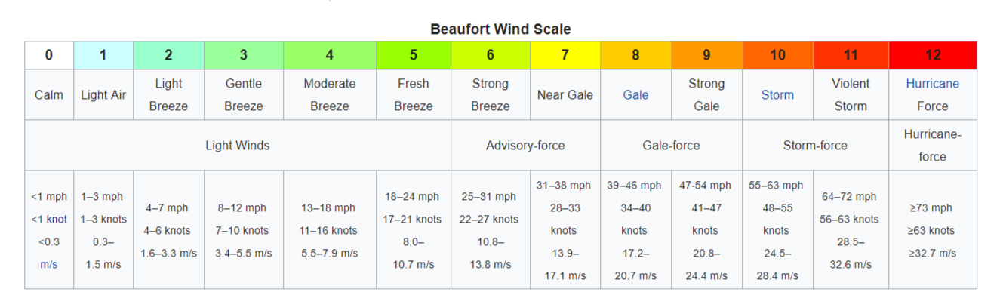

# 04 Gone with the wind! (anemic vs domain)

# Anemic class approach

## Classes

Anemic classes contains nothing more than just data.
All business logic is stored in separate classes `Services`, `Converters`, `Utils` you call it.

* [BeaufortScale](src//main//java//io//github//javafaktura//s01e05//anemic//BeaufortScale.java) - anemic class storing only data of [Beaufort scale](https://en.wikipedia.org/wiki/Beaufort_scale)
* [KnotsToBeaufortScaleConverter](src//main//java//io//github//javafaktura//s01e05//anemic//KnotsToBeaufortScaleConverter.java) - logic converting [knot units](https://en.wikipedia.org/wiki/Knot_(unit)) to [Beaufort scale](https://en.wikipedia.org/wiki/Beaufort_scale)
* [WaveHeightToBeaufortScaleConverter](src//main//java//io//github//javafaktura//s01e05//anemic//WaveHeightToBeaufortScaleConverter.java) - logic converting wave height to [Beaufort scale](https://en.wikipedia.org/wiki/Beaufort_scale)

## Tests

* [KnotsToBeaufortScaleConverterTest](src//test//java//io//github//javafaktura//s01e05//anemic//KnotsToBeaufortScaleConverterTest.java) - tests covering [knot units](https://en.wikipedia.org/wiki/Knot_(unit)) converter logic
* [WaveHeightToBeaufortScaleConverterTest](src//test//java//io//github//javafaktura//s01e05//anemic//WaveHeightToBeaufortScaleConverterTest.java) - tests covering wave converter logic

Smells (sometimes opinionated):
* :hankey: Testing private methods and exposing too much
* :hankey: Data separated from logic makes it harder to maintain
* :hankey: Less object oriented design of code
* :hankey: Breaking single responsibility in `WaveHeightToBeaufortScaleConverterTest`
* :hankey: Avoiding edge cases in tests
* :hankey: Breaking DRY rule by testing multiple times the same scenarios, first for "private methods" then for public ones
* :hankey: Too many `if`s instructions in both converters

## Domain approach

### Classes

Domain classes contains both data and business logic.

* [BeaufortScale](src//main//java//io//github//javafaktura//s01e05//domain//BeaufortScale.java) - domain class with more responsible approach data + logic of [`Beaufort scale`](https://en.wikipedia.org/wiki/Beaufort_scale)
* [Knot](src//main//java//io//github//javafaktura//s01e05//domain//Knot.java) - value object class representing [knot unit](https://en.wikipedia.org/wiki/Knot_(unit))
* [Foot](src//main//java//io//github//javafaktura//s01e05//domain//Foot.java) - value object class representing [foot unit](https://en.wikipedia.org/wiki/Foot_(unit))
* [Meter](src//main//java//io//github//javafaktura//s01e05//domain//Meter.java) - value object class representing meter unit

### Tests

* [BeaufortScaleFromKnotsTest](src//test//java//io//github//javafaktura//s01e05//domain//BeaufortScaleFromKnotsTest.java) - testing conversion from knot units to Beaufort scale
* [BeaufortScaleFromWaveHeightInFootsTest](src//test//java//io//github//javafaktura//s01e05//domain//BeaufortScaleFromWaveHeightInFootsTest.java) - testing conversion from wave height defined in foot units to Beaufort scale
* [BeaufortScaleWaveHeightInMetersTest](src//test//java//io//github//javafaktura//s01e05//domain//BeaufortScaleWaveHeightInMetersTest.java) - testing conversion from wave height defined in meter units to Beaufort scale
* [FootTest](src//test//java//io//github//javafaktura//s01e05//domain//FootTest.java) - testing foot unit class methods
* [MeterTest](src//test//java//io//github//javafaktura//s01e05//domain//MeterTest.java) - testing meter unit class methods

Good practices (sometimes opinionated):
* :+1: Not exposing any private methods
* :+1: Data glued with its logic makes it easier to test and maintain in the future
* :+1: More object oriented approach
* :+1: Keeping single responsible rule - each class has its own responsibility
* :+1: Testing only whats necessary, keeping DRY rule
* :+1: Provided multiple edge cases, when given logic might become problematic
* :+1: If single test class is too big, it might be good to separate tests across multiple files (this might also spawn idea of dividing original code into multiple classes as well)
* :+1: Clever too many `if` operations avoidance by Stream API operations

# Why domain driven models might be better for testing purposes?

* :+1: More modular - smaller classes/methods that are easier to test
* :+1: POJOs with no dependencies on infrastructure - quickly test in isolation
* :+1: This architecture supports higher amount of unit tests and in the end it is easier to maintain test pyramid shape

I find this article very interesting to expand these concepts [https://herbertograca.com/2017/11/16/explicit-architecture-01-ddd-hexagonal-onion-clean-cqrs-how-i-put-it-all-together/](https://herbertograca.com/2017/11/16/explicit-architecture-01-ddd-hexagonal-onion-clean-cqrs-how-i-put-it-all-together/)

